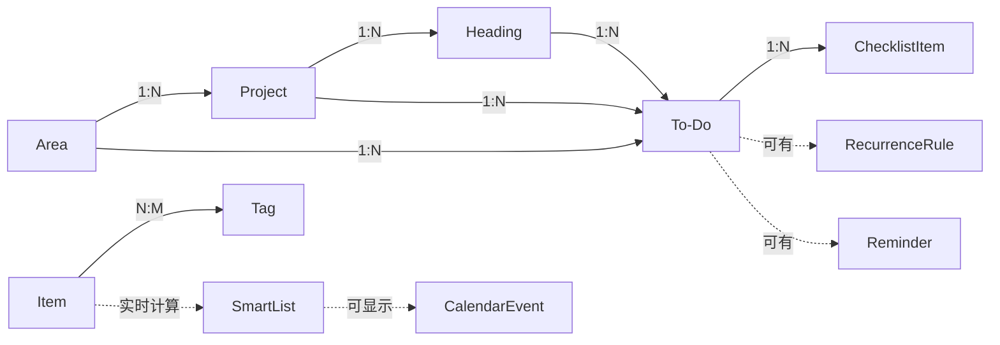
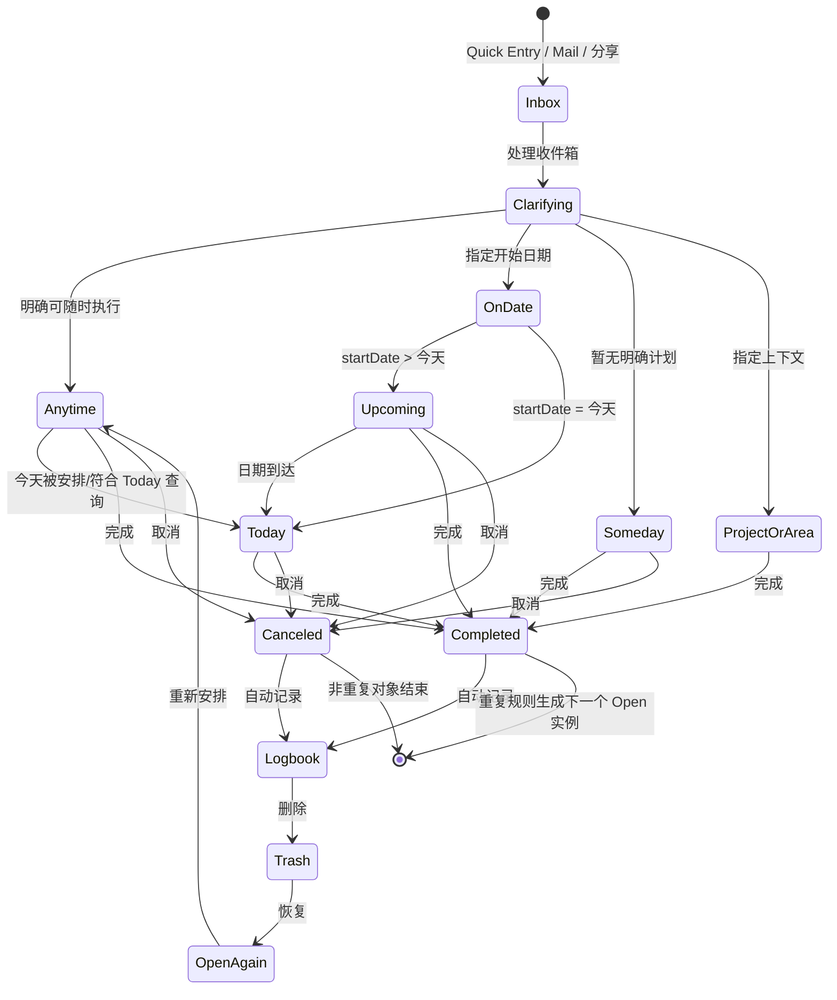
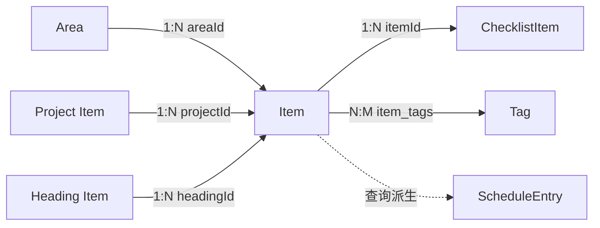
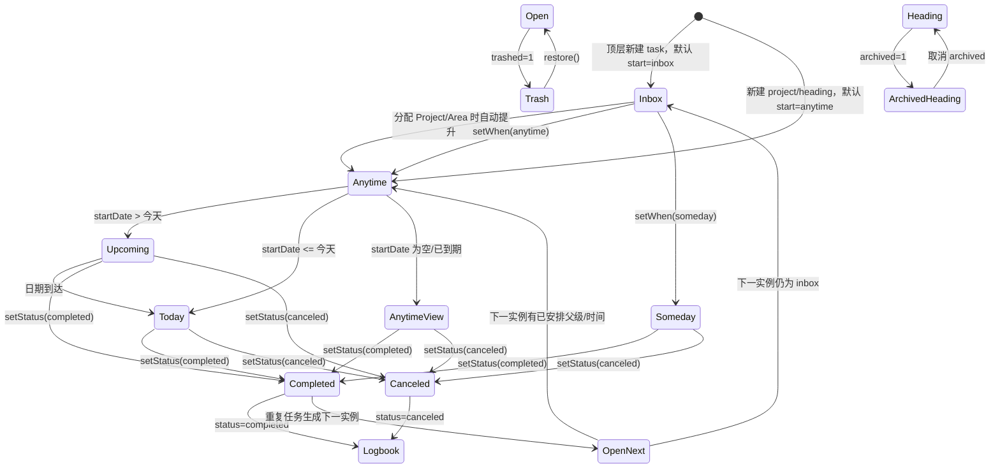

# Things 3 与 Things Flutter 数据模型文档

> 目的：把 Things 3 Mac 中可观察、且由官方文档/API 字段明确的概念整理成对象模型，再与当前仓库的实现进行对照。
>
> 范围：Things 3 Mac 的列表、待办、项目、标题、区域、标签、清单、日期/提醒、重复和归档语义；当前仓库 `master`（v0.9，commit `292b89a`）的 Flutter 数据层和桌面端交互。
>
> 说明：Things 3 的内部数据库不是公开 schema。下文将“官方字段”与“为了说明关系而抽象出的派生对象”分开标注，避免把 UI 列表误认为一张真实数据表。

## 结论摘要

1. Things 3 的关键设计是把“是否仍在收件箱”和“何时开始”拆成两个维度：`Is Inbox` 是捕获/澄清状态，`Start` 是 `On Date / Anytime / Someday` 之一。Today、Upcoming、Anytime、Someday 主要是基于这些字段实时计算出来的视图，而不是四种互斥的 `status`。
2. 当前项目已经覆盖了核心骨架：`task/project/heading`、`area`、`tag`、`checklist`、`start/deadline/reminder/repeat`、完成/取消/回收站/日志簿查询。但当前把 `inbox` 也放进了 `WhenStart`，因此“捕获位置”和“时间安排”没有完全分离；还缺少备注、独立 `isLogged`、附件/链接、日历事件实际数据、更多快捷操作和完整项目生命周期。
3. 你看到“新建待办都在随时”并不一定是异常：当前桌面弹窗顶层新建默认收件箱；但是在项目或区域内新建时，保存逻辑会把收件箱提升为 `anytime`，因为它已经有明确上下文。具体逻辑见本文“收件箱与随时”和本项目 `add_edit_item_modal.dart`。

## 1. Things 3 数据模型概念

### 1.1 `Item`：所有可显示对象的共同抽象

Things 3 的公开 Shortcuts 字段把对象分成 To-Do、Heading、Project、Area 四类。下面是四类共享的概念字段；并非每个字段都适用于每一种类型。

```text
Item {
  id: String
  type: ToDo | Heading | Project | Area
  title: String
  parentId: String?                 // To-Do/Heading -> Project；Project -> Area；Area 无父级
  status: Open | Completed | Canceled
  completionDate: DateTime?
  isLogged: Bool                    // 是否已进入 Logbook 语义
  tags: [TagRef]                    // 直接标签
  allMatchingTags: [TagRef]         // 直接标签 + 从父级继承的标签
  creationDate: DateTime
  modificationDate: DateTime
}
```

`status` 描述对象是否完成/取消；`isLogged` 描述是否已归档到日志簿。这两个概念不能混用。官方字段说明见 [Things Shortcuts 字段参考](https://culturedcode.com/things/support/articles/9596775/)。

### 1.2 `ToDo`：可执行的待办

```text
ToDo extends Item {
  type: ToDo
  notes: String?
  projectId: String?
  headingId: String?
  isInbox: Bool

  start: OnDate | Anytime | Someday
  startDate: Date?
  evening: Bool?                     // startDate 是今天时，放入“今晚”区段
  reminderDate: DateTime?            // 提醒时间，通常锚定 startDate
  deadline: Date?

  checklist: [ChecklistItem]
  repeat: RecurrenceRule?
}
```

语义要点：

- `isInbox=true` 表示还在收件箱，等待澄清；它不是完成状态。
- `start=OnDate` 时才有 `startDate`；日期到达后项目从 Upcoming 进入 Today。
- `deadline` 是“最晚完成日期”，不是开始日期。带 deadline 的待办仍可出现在 Anytime。
- `notes` 支持 Markdown；官方说明见 [Notes](https://culturedcode.com/things/support/articles/4438545/)。Things 3 官方笔记能力不等于附件仓库。

### 1.3 `Project`：有结果的多步骤容器

```text
Project extends Item {
  type: Project
  areaId: String?
  notes: String?
  start: OnDate | Anytime | Someday
  startDate: Date?
  evening: Bool?
  reminderDate: DateTime?
  deadline: Date?
  repeat: RecurrenceRule?

  headingIds: [String]
  todoIds: [String]
}
```

项目既是一个可安排的对象，也是一组待办的父容器。项目可以属于一个 Area；项目中的 Heading 和 To-Do 不能再挂到另一个 To-Do 下。项目完成/取消后进入 Logbook，项目的子项随项目一起成为已归档上下文。

### 1.4 `Heading`：项目内的分组标题

```text
Heading extends Item {
  type: Heading
  projectId: String
  todoIds: [String]
}
```

Heading 只存在于 Project 内，不能放在 Area、Today、Inbox 等独立列表中。它主要承担排序和分组，不是一个可执行 To-Do；官方说明见 [Headings](https://culturedcode.com/things/support/articles/2803577/)。归档 Heading 会把它和子项隐藏到项目底部的已记录内容中。

### 1.5 `Area`：长期责任领域

```text
Area extends Item {
  type: Area
  parentId: null
  projectIds: [String]
  todoIds: [String]
}
```

Area 表示持续存在的责任范围（例如“工作”“家庭”），没有项目式的完成日期。To-Do/Project 可以直接属于 Area；Area 的标签可被子对象继承。

### 1.6 `Tag`：横向分类维度

```text
Tag {
  id: String
  title: String
  shortcut: String?
  parentTagId: String?
  childTagIds: [String]
  sortOrder: Int
}

ItemTag {
  itemId: String
  tagId: String
  source: Direct | Inherited
}
```

标签与对象是多对多关系。标签可以嵌套/分组；项目或区域上的标签会被子项用于筛选，但子项不一定显示继承来源。官方说明见 [Tags](https://culturedcode.com/things/support/articles/2803581/)。

### 1.7 `ChecklistItem`：待办内部的检查项

```text
ChecklistItem {
  id: String
  todoId: String
  title: String
  isCompleted: Bool
  sortOrder: Int
}
```

Checklist 是一个 To-Do 的内部完成清单，不进入 Today/Upcoming 等顶层列表，也没有单独的提醒、标签和父项目关系。

### 1.8 `RecurrenceRule`：重复规则与下一个实例

```text
RecurrenceRule {
  frequency: Daily | Weekday | Weekly | Monthly | Yearly | Custom
  interval: Int
  weekdays: [Weekday]?
  dayOfMonth: Int?
  endDate: Date?
  nextOccurrence: Date?
}
```

这是行为层抽象。Things 3 在完成一个重复待办后生成下一个开放实例；当前展示字段也包含重复、间隔和下一次日期。具体重复选项以客户端界面为准。

### 1.9 `Reminder` 与 `CalendarEvent`

```text
Reminder {
  itemId: String
  fireAt: DateTime
}

CalendarEvent {                      // 外部日历的只读投影，不是 Things 待办
  externalId: String
  calendarId: String
  title: String
  startAt: DateTime
  endAt: DateTime
  isAllDay: Bool
}
```

Reminder 是通知时间；CalendarEvent 来自 Apple Calendar，显示在 Today/Upcoming 时不改变待办的 `status`。官方日历说明见 [Calendar Integration](https://culturedcode.com/things/support/articles/2803583/)。

### 1.10 列表/投影，而非单独的待办状态

```text
SmartList {
  kind: Inbox | Today | Upcoming | Anytime | Someday | Logbook
       | Tomorrow | Deadlines | Repeating | AllProjects | LoggedProjects
       | Area | Project | Tag
  title: String
  visibleInSidebar: Bool
  query: Predicate<Item>
}
```

默认列表不可重命名、删除或随意重排。一个对象可以同时满足多个投影，例如“今天”的待办也可能在“随时”里显示；这正是列表与状态分离的结果。官方语义见 [Default Lists](https://culturedcode.com/things/support/articles/4001304/) 与 [Scheduling](https://culturedcode.com/things/support/articles/2803579/)。

### 1.11 `LogbookEntry` 与 `TrashEntry`

```text
LogbookEntry {
  itemId: String
  originalType: ToDo | Project | Heading
  status: Completed | Canceled
  loggedAt: DateTime
  completionDate: DateTime?
}

TrashEntry {
  itemId: String
  deletedAt: DateTime
  restoreable: Bool
}
```

这两个对象更适合看成生命周期投影。Logbook 长期保存已完成/已取消项目和待办；Trash 是删除后的可恢复区，两者不是同一回事。

## 2. Things 3 对象关系



关系约束：

- Area 是顶层长期容器；Project 可属于 Area；Project/Area 都可以直接拥有 To-Do。
- Heading 必须属于 Project；To-Do 可以属于 Project、Heading，或作为顶层 To-Do。
- 标签是横向关系，不改变 To-Do 的父子结构。
- Today、Upcoming、Anytime、Someday、Logbook 等是查询投影，不应作为每个对象的互斥枚举字段。

## 3. Things 3 状态机

### 3.1 捕获、安排、完成三条正交轴



更准确地说：

- `Status` 只有 Open、Completed、Canceled。
- `Is Inbox` 表示是否仍在捕获区；处理后关闭它。
- `Start` 只有 On Date、Anytime、Someday；Today/Upcoming 是日期投影，不是新的持久状态。
- `Deadline` 不会把对象变成另一个状态；它只是紧迫性/筛选条件。
- 完成或取消后进入 Logbook；重复待办会再产生一个 Open 实例。

## 4. 当前 Things Flutter 数据模型

### 4.1 `Item`

源码：`lib/domain/models/item.dart`、`lib/data/database/schema.dart`。

```text
Item {
  id: String
  userId: String
  type: task | project | heading
  title: String
  status: open | completed | canceled
  completedAt: DateTime?
  trashed: Bool

  start: inbox | anytime | someday
  startDate: Date?
  evening: Bool
  deadline: Date?
  repeat: none | daily | weekday | weekly | monthly | monthlyLast
          | monthlyNthWeekday | yearly
  repeatInterval: Int?
  reminderTime: String?

  archived: Bool                    // 当前主要用于 Heading
  areaId: String?
  projectId: String?
  headingId: String?
  sortOrder: Int
  todaySortOrder: Int?
  createdAt: DateTime
  updatedAt: DateTime
}
```

当前实现已经把类型、生命周期、父级、安排日期和排序放进统一 `items` 表。缺少 Things 3 对应的 `notes`、`isInbox`、`isLogged`、结构化 Reminder/Recurrence、外部链接/来源等字段。

### 4.2 其他模型

```text
Area {
  id: String
  userId: String
  title: String
  sortOrder: Int
  createdAt: DateTime
  updatedAt: DateTime
}

ChecklistItem {
  id: String
  itemId: String
  title: String
  isCompleted: Bool
  sortOrder: Int
}

Tag {
  id: String
  title: String
  parentTagId: String?
  sortOrder: Int
}

ItemTag {
  userId: String
  itemId: String
  tagId: String
  updatedAt: DateTime
}

ScheduleEntry {                     // 派生查询结果
  item: Item
  date: Date
  isDeadline: Bool
  isShadow: Bool                     // 重复项的未来影子
}

ProjectProgress {                    // 派生统计结果
  total: Int
  completed: Int
}
```

日历服务目前是安全空实现：`isAvailable=false`、权限检查为 false、事件查询返回空数组。因此模型层尚未真正拥有 `CalendarEvent`。

### 4.3 当前关系



当前模型允许：Area 直接挂 Item、Project 挂 Heading/Task、Heading 挂 Task。仓库通过 `projectId/headingId/areaId` 维护父级；标签继承在查询层计算，而非写入每个子项。

## 5. 当前项目的状态机与列表计算



对应查询实现：

- Inbox：`type=task AND status=open AND trashed=0 AND start=inbox`。
- Today：当前查询把 `start=anytime` 且 `startDate<=今天` 的任务，以及临近 deadline 的对象拉入；因此与官方“start date/reminder/repeating rule 匹配今天”的完整语义仍有差距。
- Upcoming：`start=anytime` 且 `startDate>今天`。
- Anytime：`start=anytime` 且没有未来 startDate；当前会包含同时落入 Today 的任务，这是 Things 3 也允许的重叠展示。
- Someday：`start=someday`。
- Logbook：`status in (completed,canceled)` 的 task/project，按 `completedAt` 倒序；不含 Heading。
- Trash：`trashed=1`。

## 6. Things 3 与当前模型对比

| 概念 | Things 3 | 当前 Things Flutter | 差距/影响 |
|---|---|---|---|
| 对象类型 | To-Do、Heading、Project、Area | task、heading、project；Area 为独立模型 | 基本齐全，但类型命名不同，Area 未统一到 Item |
| 收件箱 | `isInbox` 独立于 Start | `start=inbox`，捕获和安排耦合 | 无法表达“已离开收件箱但仍未选 Anytime/Someday”的中间态 |
| 时间安排 | On Date、Anytime、Someday；Today/Upcoming 为投影 | inbox、anytime、someday；Today/Upcoming 查询投影 | 需拆分 `isInbox` 与 `start`，并统一 Today 规则 |
| 状态 | Open、Completed、Canceled | open、completed、canceled | 核心一致 |
| 日志簿 | Completed/Canceled + `isLogged`；项目/待办/标题均可归档 | completed/canceled 查询；无独立 logged 字段，Heading 不进入日志簿 | 归档和“完成”不能独立操作，项目历史不完整 |
| 回收站 | 删除后的独立恢复区 | `trashed` 布尔字段 + Trash 查询 | 可用，但缺少 deletedAt、永久删除和审计信息 |
| 备注 | To-Do/Project 支持 Markdown notes | 明确移除了 notes | 无法实现 Things 详情页核心信息承载 |
| Checklist | To-Do 内部清单 | `ChecklistItem` | 已覆盖，缺少 Markdown/快捷编辑等交互细节 |
| 父子关系 | Area→Project/To-Do；Project→Heading/To-Do；Heading→To-Do | Area→Item；Project/Heading 通过外键挂 Item | 结构接近；需补充移动、复制、转换的完整约束 |
| 标签 | 多对多、可嵌套、父级标签继承 | 多对多、parentTagId、查询时继承 | 已有核心关系，缺快捷键、分组管理和多标签 AND 筛选完整交互 |
| 重复 | 规则对象，完成后产生下一个开放实例 | 枚举 + interval，完成时克隆下一实例 | 已有主流程；规则表达和例外日期需结构化 |
| Reminder | 与开始日期关联的通知时间 | `reminderTime` 字符串 + 通知服务 | 需要明确时区、日期关联和持久化通知状态 |
| Deadline | 独立的最晚完成日期，仍可出现在 Anytime | `deadline` 已有，Today 查询额外包含临近 deadline | 需要把“逾期/临近”作为投影规则而非改变 start |
| 日历 | Today/Upcoming 显示外部 CalendarEvent | 日历服务空实现 | 功能缺口明确 |
| 列表 | 还有 Tomorrow、Deadlines、Repeating、All Projects、Logged Projects 等隐藏列表 | 主要有 Inbox/Today/Upcoming/Anytime/Someday/Logbook/Trash | 缺少隐藏列表和统一 Quick Find 入口 |
| 快速捕获 | Quick Entry、Autofill、Mail to Things、分享扩展 | 全局捕获面板，当前进入 AI 捕获流程；deep link 仅支持 capture/add | 入口存在，但非 Things 式纯文本捕获，外部来源字段也不足 |
| 笔记/链接 | Markdown、网页/邮件来源链接 | 无 notes，capture/add 仅传 title | 需要补 `notes`、`sourceUrl`、来源元数据 |
| 复制/模板 | 项目/待办可复制；普通项目即可作为模板 | 暂无完整 duplicate/template API | 新手教学与批量建项目体验不足 |
| 时间戳 | creation/modification/completion/logged 等 | created/updated/completed | 缺 `loggedAt`、`deletedAt`、source/同步冲突字段 |

## 7. Things 3 的日志簿（Logbook）是什么，我们有没有

Things 3 的 Logbook 是“已完成/已取消内容的长期归档”，用于回顾历史，不再参与当前行动列表；官方默认列表说明见 [Logbook](https://culturedcode.com/things/support/articles/4001304/)。它不是 Trash，也不是一个把开放任务暂时隐藏的按钮。项目、待办和项目内已归档 Heading 都可以在历史上下文中保留。

当前项目“有一个基础版”：

- 侧边栏存在 `AppView.logbook`。
- `watchLogbook` 查询 `status=completed/canceled` 的 task/project，按 `completedAt` 倒序。
- 完成重复任务时会生成下一条开放实例，旧实例留在日志簿。

但它还不是 Things 3 的完整等价物：没有 `isLogged/loggedAt` 字段，没有显式“记录/取消记录”动作，Heading 不进入日志簿，已归档 Heading 只是 `archived` 后从项目当前视图隐藏；也没有 Logged Projects 等隐藏查询和完整历史筛选。

建议把日志簿建模为生命周期投影，而不是再增加一种 `status`：

```text
isLogged = status in (completed, canceled) OR explicitlyLogged
loggedAt = first time entering Logbook
```

这样才能支持“完成”和“记录”分离、项目/标题历史、按日期/区域/标签回顾。

## 8. 收件箱（Inbox）与随时（Anytime）的区别

| 维度 | 收件箱 Inbox | 随时 Anytime |
|---|---|---|
| 目的 | 暂存未经处理的想法/输入 | 存放已经澄清、现在有空即可做的行动 |
| 是否已澄清 | 通常未澄清 | 已澄清，有明确标题和上下文 |
| 时间 | 尚未决定何时做 | 没有未来开始日期；今天也可能同时显示 |
| 父级 | 通常没有 Project/Area/Heading | 可以有 Project/Area/Heading |
| 下一步 | 分配项目/区域、加日期、改成 Someday 或删除 | 直接执行、移动、加 deadline/reminder 或完成 |
| 离开条件 | 被处理后离开 Inbox | 改成 On Date/Someday、完成、取消或删除 |

官方把 Inbox 定义为“临时的、未经处理的想法收集区”，把 Anytime 定义为“当前开放、没有特定日期、任何时候都可以处理的待办”；两者不是同一个列表的两种名称。详见 [Default Lists](https://culturedcode.com/things/support/articles/4001304/)。

### 为什么当前项目里的待办经常直接出现在“随时”

当前代码的行为是有意设计出来的：

1. 顶层新建 task 的弹窗默认 `WhenChoice.inbox`，因此不指定上下文时应进入收件箱。
2. 如果在 Project 或 Area 内新建，`add_edit_item_modal.dart` 在保存时会把 `inbox` 自动提升为 `anytime`；因为用户已经给它选择了上下文，它不再是“未处理输入”。
3. 新建 Project 默认就是 `WhenStart.anytime`；项目中的 Heading 也默认跟随可行动上下文。
4. AI 捕获和部分 deep link 会直接创建 `anytime` 或带父级的任务，因此也会绕过 Inbox。

所以你现在看到 Inbox 为空、Anytime 很多，通常意味着任务是在项目/区域中直接创建，或创建后被自动安排了。如果要模拟 Things 3 的纯捕获流程，应从顶层 Quick Entry 建立一个不带 Project/Area 的任务，先保留 `inbox`，之后再统一澄清；如果任务已经知道归属项目，则直接进入 Anytime 是合理的。

## 9. 为接近 Things 3，数据模型建议的优先级

### P0：修正两个核心轴

```text
Item {
  isInbox: Bool
  start: anytime | onDate | someday
  startDate: Date?
}
```

兼容迁移规则：旧 `start=inbox` → `isInbox=true, start=anytime`；旧 `start=anytime/someday` → `isInbox=false`。这样可以表达“已离开收件箱，但尚未决定时间”的真实状态，并避免把 Inbox 当成 When 枚举值。

### P1：补齐详情和生命周期

- `notes`（To-Do/Project，Markdown）。
- `isLogged`、`loggedAt`、`deletedAt`，并让 Heading 也能进入 Logbook。
- 结构化 `Reminder`、`RecurrenceRule`、时区和来源字段。
- `sourceUrl/sourceApp`，支撑 Autofill、邮件/网页捕获和深链回溯。

### P1：统一列表投影

把 Inbox、Today、Upcoming、Anytime、Someday、Logbook、Trash、Tomorrow、Deadlines、Repeating、All Projects、Logged Projects 都实现成查询 provider；不要把它们都写成互斥持久状态。尤其修正 Today：同时考虑 start date、deadline、提醒/重复规则和日历事件。

### P2：补齐关系操作

- Project/Heading/Area 的移动、复制、转换和批量排序。
- 标签快捷键、嵌套分组、多标签 AND 筛选。
- 项目模板（普通 Project 复制即可作为模板）。
- 多窗口、Quick Find、键盘快捷键和纯文本 Quick Entry。

## 10. 参考资料与代码入口

### Things 3 官方资料

- [Shortcuts Actions：对象类型与字段](https://culturedcode.com/things/support/articles/9596775/)
- [默认列表：Today / Upcoming / Anytime / Someday / Inbox / Logbook](https://culturedcode.com/things/support/articles/4001304/)
- [Scheduling：Start Date、Reminder、Deadline](https://culturedcode.com/things/support/articles/2803579/)
- [Headings](https://culturedcode.com/things/support/articles/2803577/)
- [Tags](https://culturedcode.com/things/support/articles/2803581/)
- [Notes](https://culturedcode.com/things/support/articles/4438545/)
- [Quick Entry / Autofill](https://culturedcode.com/things/support/articles/2249437/)
- [Calendar Integration](https://culturedcode.com/things/support/articles/2803583/)

### 当前仓库代码入口

- `lib/domain/models/item.dart`：Item、Area、ChecklistItem、Tag、派生 ScheduleEntry。
- `lib/data/database/schema.dart`：items、areas、checklist_items、tags、item_tags 表结构。
- `lib/data/repositories/item_repository.dart`：创建、移动、安排、完成/取消、重复、日志簿、回收站查询。
- `lib/presentation/shared/widgets/add_edit_item_modal.dart`：顶层新建默认 Inbox；项目/区域内新建提升为 Anytime。
- `lib/presentation/screens/task_detail_screen.dart`：待办详情字段和编辑流程。
- `lib/data/services/calendar_service.dart`：当前日历空实现。
