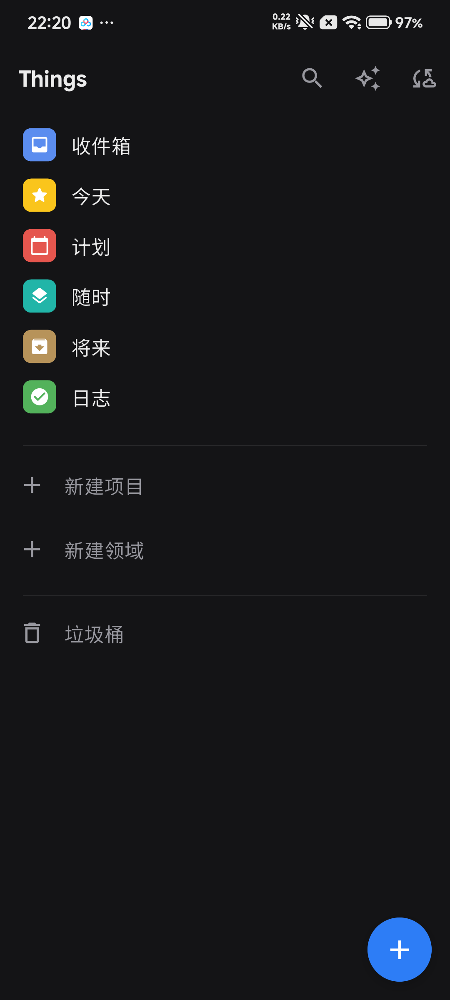
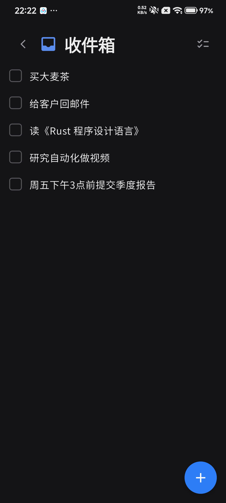
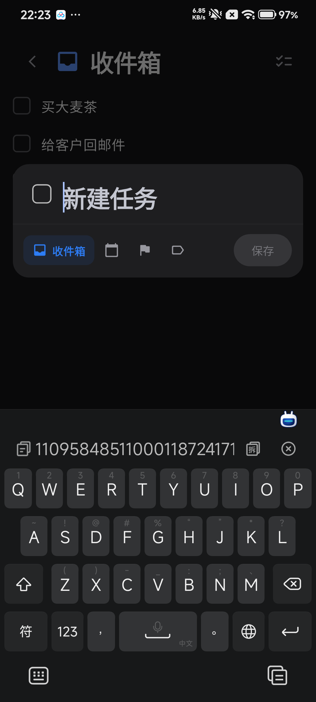
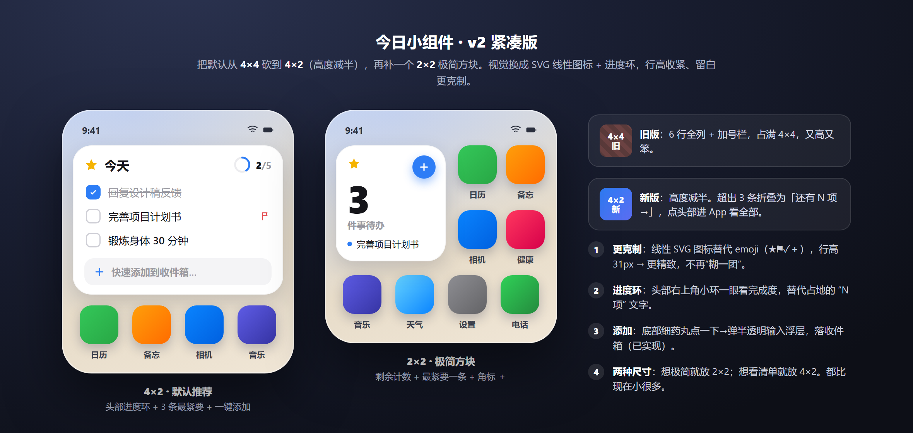
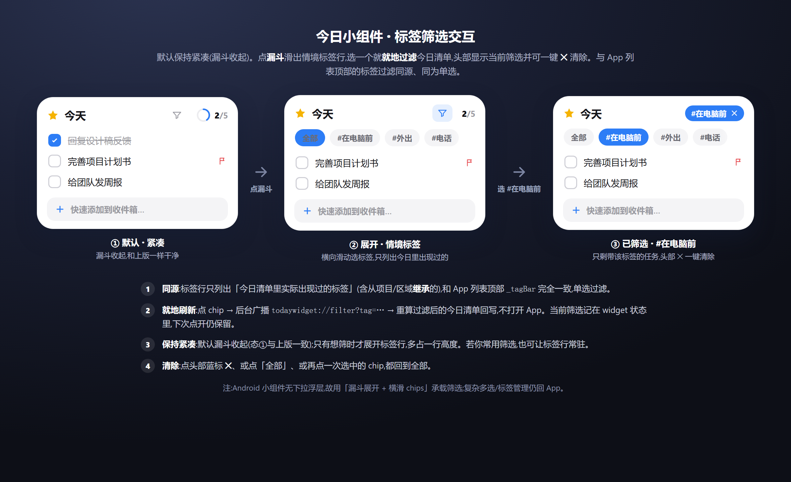
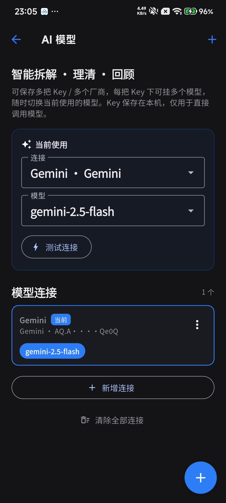

# Things Flutter · 操作文档

一个 Things 3 风格、融入 GTD 方法论与 AI 助手的任务管理 App（Flutter 实现）。
本文带你从「捕获 → 理清 → 组织 → 回顾 → 执行」完整走一遍。

> 截图说明：主界面为 Android 真机截图；标注「原型」的图来自高保真设计稿（功能已实现，效果一致）。

<p align="center">
  
  &nbsp;&nbsp;
  
</p>

---

## 目录
- [1. 安装](#1-安装)
- [2. 核心概念：GTD 的几个桶](#2-核心概念gtd-的几个桶)
- [3. 捕获：把念头快速记下来](#3-捕获把念头快速记下来)
- [4. 组织：滑动 / 拖拽 / 标签 / 清单](#4-组织滑动--拖拽--标签--清单)
- [5. AI 理清：把模糊念头变成可执行的一步](#5-ai-理清把模糊念头变成可执行的一步)
- [6. 一键回顾：每周给系统做个体检](#6-一键回顾每周给系统做个体检)
- [7. 桌面小组件](#7-桌面小组件)
- [8. AI 模型配置](#8-ai-模型配置)
- [9. 云同步](#9-云同步)
- [10. 平台支持](#10-平台支持)

---

## 1. 安装

- **Android**：在 [Releases](../../releases) 下载最新 `things-flutter-*-android.apk` 安装。
  小米/MIUI 用户若用 adb/USB 安装，需先在「开发者选项」里打开 **USB 安装**。
- **Windows**：下载 `things-flutter-*-windows-x64.zip`，解压后运行 `things3_clone.exe`。
- **从源码运行**：

```bash
flutter pub get
flutter run
```

---

## 2. 核心概念：GTD 的几个桶

应用把任务按 GTD 的时间意图分到几个系统视图：

| 视图 | 含义 |
| --- | --- |
| **收件箱** | 随手记下、还没理清的念头。先清空大脑，之后再整理。 |
| **今天** | 今天要做的事（含逾期、临近死线会自动上浮）。 |
| **计划** | 安排在未来某天的任务，按日期排在时间轴上。 |
| **随时** | 没有指定日期、随时可做的任务。 |
| **将来** | 暂时不做、孵化中的想法（冷冻库）。 |
| **日志** | 已完成/已取消的归档。 |

任务还可归入 **领域（Area）** 与 **项目（Project）**，项目带进度圆环。

---

## 3. 捕获：把念头快速记下来

三种捕获方式，对应不同场景：

1. **新建任务弹窗**：点右下角「+」。白纸优先——打开只有标题输入框，按需点亮「清单 / 何时 / 死线 / 标签」，不填不显示。

<p align="center"></p>

> 真机：打开只有标题 + 一条工具条，点亮「收件箱 / 日期 / 旗标 / 标签」才展开对应选项。

2. **Magic Plus（魔法加号）**：长按「+」后拖拽到「今天 / 今晚 / 收件箱」等投放区，松手即落到对应桶。

3. **桌面小组件**：不打开 App 也能一键加任务到收件箱，见[第 7 节](#7-桌面小组件)。

> 捕获阶段不必想清楚——先记下来，进收件箱，之后用 AI 理清。

---

## 4. 组织：滑动 / 拖拽 / 标签 / 清单

- **左滑任务**：完成 / 计划（改期）/（配置 AI 后）理清。
- **右滑任务**：删除（继续滑到底直接删）。
- **拖拽排序**：长按任务上下拖动重排；在「今天」里可在「白天 ⇄ 今晚」之间拖动。
- **标签**：给任务打标签（如「在电脑前」「在手机上」），可按场景过滤。项目/领域上的标签会被其下任务继承。
- **清单归属**：把任务移动到某个项目或领域。

---

## 5. AI 理清：把模糊念头变成可执行的一步

收件箱里那些「学日语」「研究自动化做视频」「拍笔记」之类模糊念头，
交给一个**很懂 GTD 的 AI 教练**帮你理清。AI 只产出**草稿与建议**，决定权始终在你。

### 单条理清
在任意清单里 **左滑任务 → 「理清」**（配置 AI 后出现 ✨）：

- 如果念头模糊，AI 会先**追问 1~2 个关键问题**（带快捷选项），帮你想清楚「期望结果」和「下一步」。
- 想清楚后，AI 给出**结构化的理清卡片**：可执行标题、任务/项目、何时、死线、清单、标签、子步骤——每一项都能改。
- 点「应用」即**原地更新**这条收件箱条目。

### 批量理清
对积压的收件箱可一次过一遍（入口在回顾报告或收件箱）：

- 全屏队列逐条展示理清卡片，可**应用 / 跳过 / 编辑**。
- 打开「**自动应用高置信度建议**」，AI 很有把握的条目会自动应用，只在需要你判断时停下。

下图三屏分别为：① 单条对话式理清　② 批量理清队列　③ 一键回顾报告（原型）。


---

## 6. 一键回顾：每周给系统做个体检

主页右上角点 **回顾**（✓ 图标），秒级扫描全库，生成只读「回顾报告」：

| 区块 | 它在提醒你 |
| --- | --- |
| **待整理收件箱** | 还没理清的念头，建议「批量理清」清空 |
| **孵化区到期回顾** | 放进「将来」超过两周的想法，该激活还是继续冷冻？ |
| **项目健康** | 没有「下一步行动」、正在停摆的项目 |
| **停滞任务** | 在「随时」里被遗忘很久的散任务 |
| **AI 本周聚焦** | 基于以上给出的 2~3 句建议（配置 AI 后出现） |

每个区块都能**就地跳转**去处理。系统很干净时会显示鼓励性的「一切就绪」。

> 报告界面见[上一节](#5-ai-理清把模糊念头变成可执行的一步)配图的第三屏。

---

## 7. 桌面小组件

把常用操作放到桌面，不开 App 也能用：

- **4×2 组件**：查看「今天」要做的事，顶部可按标签筛选，一键添加 / 勾选完成。
- **2×2 简易组件**：极简，专注快速添加到收件箱。

<p align="center">
  
  &nbsp;&nbsp;
  
</p>

---

## 8. AI 模型配置

理清与回顾的 AI 能力需要先配置模型 Key（**未配置时理清入口隐藏、回顾仍可用**，只是没有 AI 建议段）。

主页右上角 **AI 模型**（✨ 图标）进入设置：

- 支持任意 **OpenAI 兼容**厂商：Gemini、OpenAI、DeepSeek、Kimi、OpenRouter 等。
- **多连接 / 多模型并存**：可保存多把 Key（多个厂商），每把 Key 下挂多个模型，顶部「当前使用」里随时切换连接与模型。
- **一键拉取模型**：在连接编辑里点「拉取该 Key 的模型」，自动列出这把 Key 支持的全部模型，点选即用（也可手动输入）。
- **测试连接**：一键发一条最小请求验证 Key / 模型 / 端点是否可用，失败时给出可操作的中文提示（如「被限流 429，请稍候重试」）。
- 填一次 Key 即本地持久化，之后启动自动生效。

<p align="center"></p>

- 也可在构建时用环境变量注入：

```bash
flutter run --dart-define=AI_API_KEY=你的key --dart-define=AI_PROVIDER=gemini
```

> Key 仅明文保存在本机偏好设置，作单机便利之用。

---

## 9. 云同步

主页右上角 **云同步**入口，基于 PowerSync 在多端之间同步任务、项目、标签等数据。

---

## 10. 平台支持

| 平台 | 状态 |
| --- | --- |
| Android | ✅ 主力支持（含桌面小组件、通知、深链） |
| Windows | ✅ 可用（CI 自动出包） |
| iOS / macOS | 🚧 Flutter 同源，可自行编译，尚未签名分发 |
| Web | 🚧 实验 |
